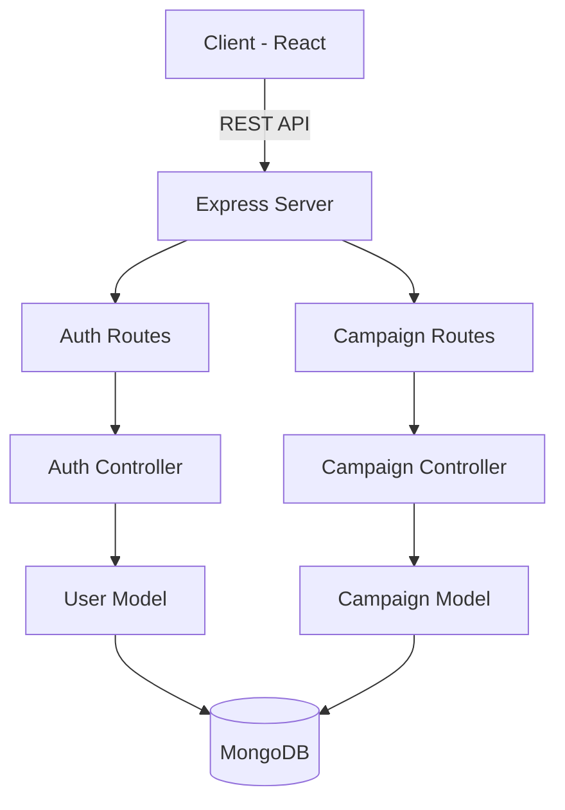

# 💎 AdEngage

**Precision AI-Powered Advertising Management Platform**

AdEngage is a luxury minimalist advertising platform designed for seamless campaign orchestration. Built with a focus on visual excellence and technical precision, it provides Brand Admins with a high-end dashboard to manage complex advertising lifecycles with ease.

---

## ✨ Design Principles
- **Luxury Minimalist**: A clean, high-contrast aesthetic using the **Outfit** and **Work Sans** typography.
- **Glassmorphism**: Subtle transluscent interface elements that provide depth and premium feel.
- **Fluid Motion**: High-performance entry animations powered by **Anime.js**.

---

## 🚀 Key Features

### 🏢 Brand Admin Dashboard
- **Campaign Intelligence**: Full CRUD (Create, Read, Update, Delete) cycle for advertising campaigns.
- **Rich Metadata**: Manage budgets, AR/Voice feature toggles, KPIs, and demographic targeting.
- **Real-time Persistence**: Session monitoring and role-based access control.

### 🔐 Secure Authentication
- **Split-Screen UX**: High-end asymmetric login/registration interface.
- **Role-Based Provisioning**: Specialized onboarding flows for Brand Admins.
- **Clean Token Flow**: JWT-based session management with secure local storage persistence.

### 🌐 High-Performance Landing
- **Section Intelligence**: Dynamic smooth scrolling with fixed glass navbar.
- **Interactive Toggles**: Modern feature comparison and pricing modules.

---

## 🛠 Tech Stack

### Frontend
- **Framework**: React 18+ (Vite)
- **Animation**: Anime.js
- **Routing**: React Router Dom v6
- **Styling**: Vanilla CSS with centralized Variable System

### Backend
- **Runtime**: Node.js & Express
- **Database**: MongoDB (Mongoose)
- **Security**: JWT (JSON Web Tokens) & BcryptJS (Password Hashing)
- **Architecture**: Modular Controller-Route-Model Pattern

---

## 🏗 System Architecture

The project follows a modular backend architecture to ensure scalability and maintainability.



---

## ⚙️ Environment Configuration

Create a `.env` file in the root directory with the following variables:

| Variable | Description |
| :--- | :--- |
| `MONGO_URI` | Connection string for your MongoDB instance |
| `JWT_SECRET` | Secret key for signing JSON Web Tokens |
| `PORT` | Backend server port (Default: 5000) |
| `VITE_API_BASE_URL` | Frontend API endpoint (e.g., http://localhost:5000) |

---

## 🚦 Getting Started

### 1. Installation
```bash
# Install root dependencies
npm install
```

### 2. Setup Database
Ensure your MongoDB instance is running and the `MONGO_URI` is correctly set in your `.env`.

### 3. Run Application
You will need two terminal sessions:

**Terminal 1: Backend Server**
```bash
node server.js
```

**Terminal 2: Frontend Client**
```bash
npm run dev
```

---

## 📂 Project Structure
```text
├── server/
│   ├── controllers/   # Business logic
│   ├── models/        # Data schemas (Mongoose)
│   └── routes/         # API Endpoints
├── src/
│   ├── components/    # Reusable UI modules
│   ├── global/        # Navbar, Footer, Layout
│   ├── pages/         # High-level views (Login, Home, Landing)
│   └── App.jsx        # Routing engine
├── server.js          # Core entry point
└── README.md          # Current documentation
```

---

## 📜 License
Private Project - Professional Use.
